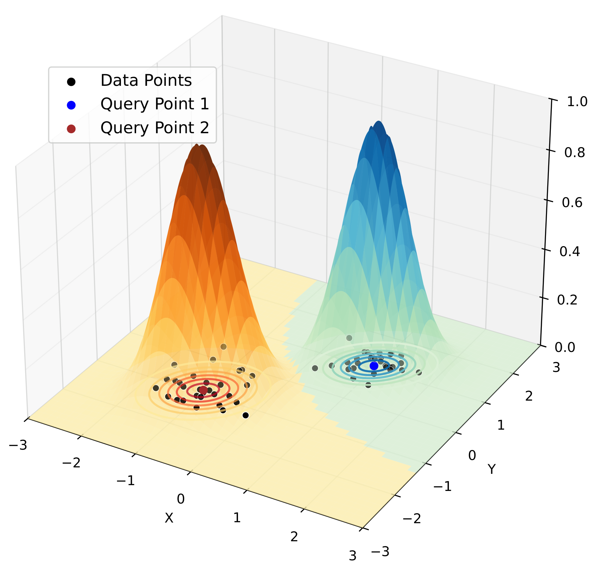
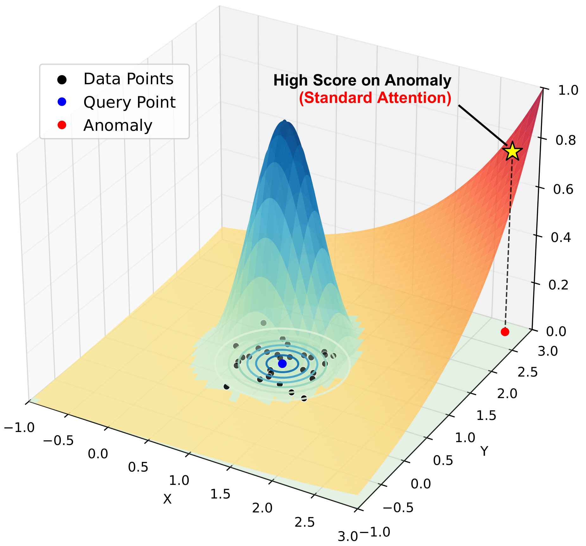
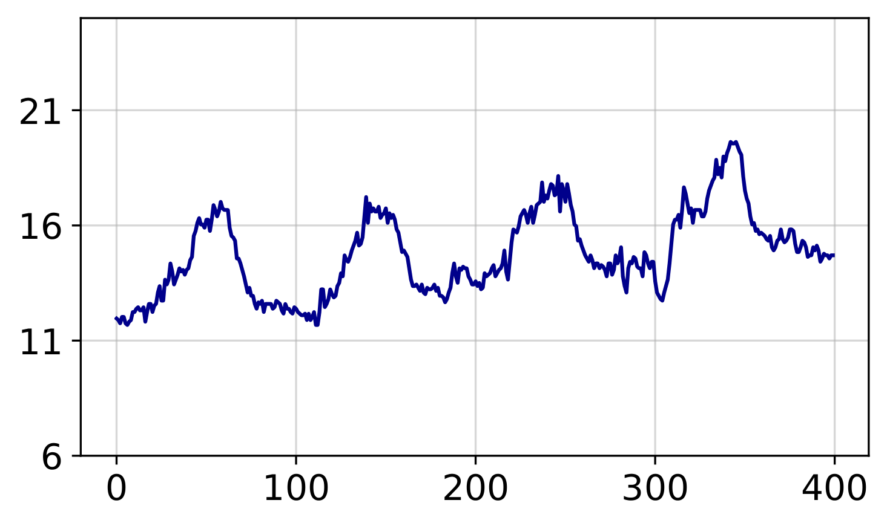
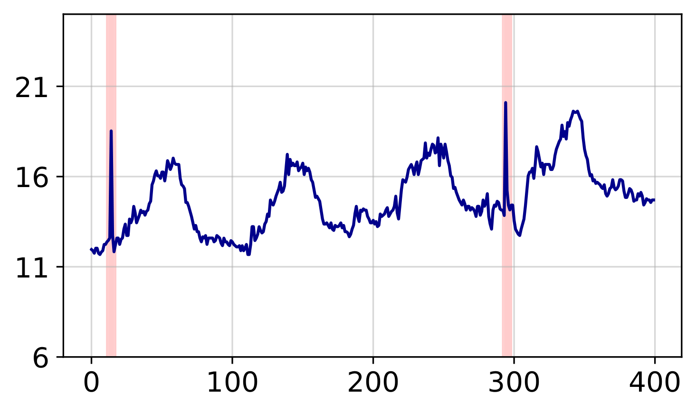
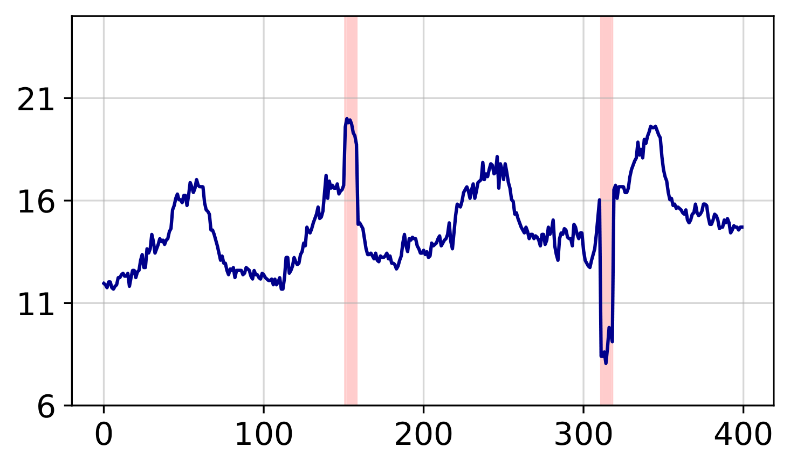
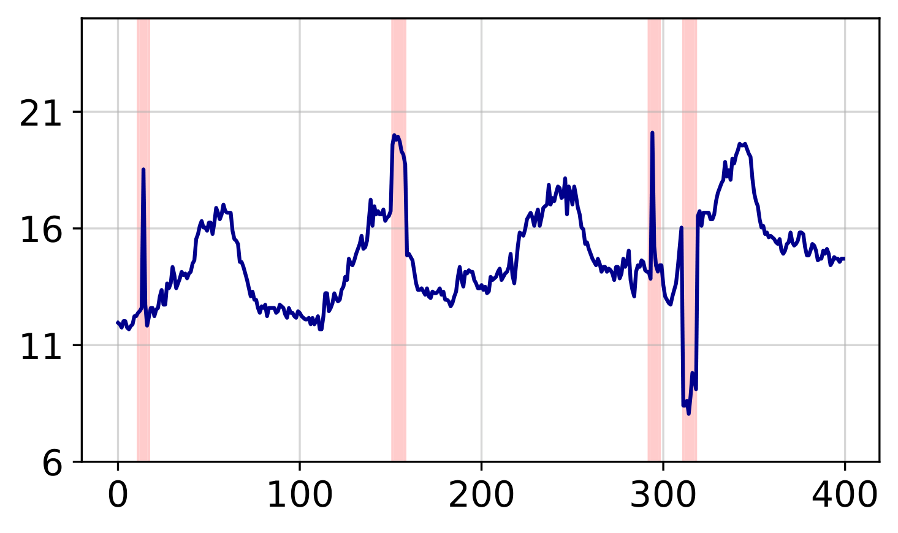

# LGA (ICLR 2026)

#### This repository is the official PyTorch implementation of LGA: [Local Geometry Attention for Time Series Forecasting under Realistic Corruptions](https://openreview.net/forum?id=NCQPCxN7ds)

## Local Geometry Attention

Standard attention uses **one global metric** for all queries. LGA learns a **query-specific distance metric** via local Gaussian process theory — each query adapts to its own local data geometry.

<p align="center">
&nbsp;&nbsp;

</p>

> **(Left)** Two query points produce distinct attention surfaces that match their local cluster shapes.
> **(Right)** Standard attention is distracted by an anomaly (high score on red dot); LGA ignores it.

## TSRBench

The first robustness benchmark for time series forecasting. Uses **Extreme Value Theory (EVT)** to inject realistic corruptions at 5 severity levels.

> Want to inject noise into **your own datasets**? TSRBench is available as a standalone pip-installable toolkit with 6 corruption types, a Python API, and support for any CSV/DataFrame input.
> Check out the **[TSRBench repository](https://github.com/dongbeank/TSRBench)** for details.

<p align="center">




</p>
<p align="center">
<b>Original</b> &rarr; <b>Exponential Spike</b> &rarr; <b>Level Shift</b> &rarr; <b>Combined</b>
</p>

## Getting Started

### Requirements

- Python >= 3.9
- CUDA-compatible GPU (recommended)

Install the required packages:
```bash
pip install -r requirements.txt
```

### Data Preparation

1. Download the datasets from [Autoformer](https://drive.google.com/drive/folders/1ZOYpTUa82_jCcxIdTmyr0LXQfvaM9vIy).
2. Create a folder named `./dataset` in the root directory of this project.
3. Place all downloaded files and folders within the `./dataset` folder.

The expected directory structure:
```
dataset/
├── ETT-small/
│   ├── ETTh1.csv
│   ├── ETTh2.csv
│   ├── ETTm1.csv
│   └── ETTm2.csv
├── electricity/
│   └── electricity.csv
└── weather/
    └── weather.csv
```

### Generating Corrupted Benchmarks (TSRBench)

**Before training or evaluation, generate the corrupted test datasets first:**

```bash
bash ./TSRBench/generate_noise.sh
```

This reads from the original dataset files and generates corrupted versions at 5 severity levels:
```
dataset/ETT-small/
├── ETTh1.csv                          # original (unchanged)
├── ETTh1_noise/
│   ├── ETTh1_level_1_type_shift.csv
│   ├── ETTh1_level_1_type_spike.csv
│   ├── ETTh1_level_1_type_combined.csv
│   ├── ...
│   └── ETTh1_level_5_type_combined.csv
├── ETTh2_noise/
│   └── ...
```

See `TSRBench/README.md` for detailed documentation on noise injection and custom datasets.

### Training

We provide scripts for all datasets used in the paper. For example:

```bash
# ETTh1
bash ./scripts/ETTh1.sh

# Weather
bash ./scripts/weather.sh

# Electricity
bash ./scripts/electricity.sh
```

You can find more scripts in the `./scripts` folder for other datasets.

### Robustness Evaluation

To evaluate a trained model under noise corruptions:
```bash
python -u run.py \
  --is_training 0 \
  --root_path ./dataset/ETT-small/ \
  --data_path ETTh1.csv \
  --model_id ETTh1_336_96 \
  --model PatchTST \
  --data ETTh1 \
  --features M \
  --seq_len 336 \
  --pred_len 96 \
  --enc_in 7 \
  --lga \
  --itr 1
```

## Project Structure

```
.
├── run.py                 # Main entry point for training and evaluation
├── models/
│   └── PatchTST.py        # Model wrapper with LGA integration
├── layers/
│   ├── PatchTST_backbone.py   # Core architecture including LGA module
│   ├── PatchTST_layers.py     # Supporting layers and embeddings
│   └── RevIN.py               # Reversible Instance Normalization
├── exp/
│   ├── exp_basic.py       # Base experiment class
│   └── exp_main.py        # Training, validation, and testing logic
├── data/
│   ├── data_factory.py    # Data provider
│   └── data_loader.py     # Dataset classes
├── utils/
│   ├── metrics.py         # Evaluation metrics (MSE, MAE, etc.)
│   ├── tools.py           # EarlyStopping, learning rate scheduling, etc.
│   ├── timefeatures.py    # Temporal feature engineering
│   └── masking.py         # Masking utilities
├── scripts/               # Shell scripts for reproducing experiments
└── TSRBench/              # Time Series Robustness Benchmark toolkit
```

## Citation

If you find this repo useful for your research, please cite our paper:
```bibtex
@inproceedings{
kim2026local,
title={Local Geometry Attention for Time Series Forecasting under Realistic Corruptions},
author={Dongbin Kim and Youngjoo Park and Woojin Jeong and Jaewook Lee},
booktitle={The Fourteenth International Conference on Learning Representations},
year={2026},
url={https://openreview.net/forum?id=NCQPCxN7ds}
}
```

## Acknowledgements

We would like to express our appreciation for the following repositories, which provided valuable code bases and datasets:

- [PatchTST](https://github.com/yuqinie98/PatchTST)
- [Autoformer](https://github.com/thuml/Autoformer)
- [Time-Series-Library](https://github.com/thuml/Time-Series-Library)

## Contact

If you have any questions or want to use the code, please contact dongbin413@snu.ac.kr
